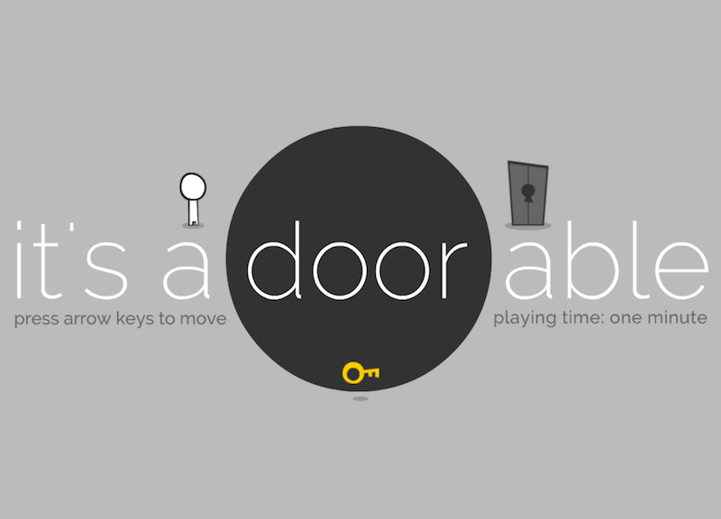

# 🎮 It's a Door-able



**"It's a Door-able"** é um mini game interativo com um conceito simples, charmoso e envolvente. Criado como parte de um projeto especial, ele oferece uma experiência rápida e divertida de cerca de **1 minuto**.

Neste jogo, você deve mover seu personagem, pegar a chave e alcançar a porta. Tudo isso com um visual minimalista e intuitivo.

---

## 🕹️ Como jogar

- **Setas do teclado**: movimentam o personagem  
- **Objetivo**: Pegue a chave e alcance a porta  
- **Duração**: Aproximadamente 1 minuto  

---

## 🧠 Conceito

O título do jogo é um trocadilho em inglês:  
**“It’s adorable”** → **“It’s a door-able”**, brincando com a palavra **door** (porta) e o estilo fofo do game.

---

## 🛠️ Tecnologias utilizadas

- HTML5  
- CSS3  
- JavaScript  
- Lógica de interação baseada em eventos de teclado  

---

## 📁 Como executar localmente

1. Clone o repositório:

   ```bash
   git clone https://github.com/Carloscb124/Interactive-birthday.git
